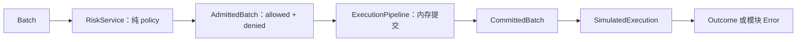

# Operation + Service + Layer/Pipeline

需要统一 dispatch、替换执行实现、检查或规划操作，或者组合多个处理阶段时，鼓励采用操作协议、执行单元和显式组合。它适用于系统服务与业务功能；普通函数或类型化方法已足够时，可以直接使用。

## 通用结构

| 部分 | 责任 | 常见表达 |
|---|---|---|
| Operation / Request | 表达这个边界要做什么及所需输入 | 闭合 enum + payload，或具体请求 struct |
| Service | 接收请求，解释执行，返回结果或模块错误 | 领域 trait、类型化方法、`tower::Service<Request>` |
| Layer | 保存装配配置，包装或构造 Service | `Layer<S>::layer(inner) -> WrappedService<S>` |
| Pipeline | 按依赖顺序连接阶段的输入输出 | 显式编排函数、具有阶段类型的组合服务 |

Layer 负责包装与装配，实际调用由生成的 Service 承担；Pipeline 负责阶段之间的数据流。两者可以一起使用：一个 Layer 生成的组合服务，内部就可以先准入、再提交、再执行。每个阶段可以接收不同类型的请求，也可以调用纯函数；不必让每个 helper 都成为独立 trait 或公开扩展点。

执行 Service 可以无状态，也可以持有 client、连接或状态 owner。值与纯规则不必塞进有状态服务；依赖由 owner 构造和接线。是否使用 Tower，取决于是否需要它的调用协议与组合生态；已有清晰的领域 trait 可以保留，通过 adapter 接入 Tower。

## 协议与业务阶段

- **操作集合闭合，解释器可替换。** enum 表达这个边界支持的操作，trait 表达执行能力；新增解释器不改变 payload。新增 enum variant 会影响穷尽匹配，新增操作和修改语义仍需检查 consumer 兼容。
- **协议跟随业务或能力边界。** 各上下文拥有自己的操作语言，通过 adapter 转换，不把支付、库存和数据库指令汇总成全局 Operation。是否暴露底层表、列或 SQL，取决于这是不是后端协议。
- **payload 表达意图和输入。** 不捕获 client、锁或执行闭包；资源由解释器 owner 持有。示例用 owned 数据便于独立检查和传递，短生命周期调用也可以按需求借用。业务约束由所属模块保护，解释器检查能力及实际执行条件。
- **统一入口保留返回契约。** `exec(Operation) -> Result<Reply>` 便于统一 dispatch，但两个 enum 本身不在编译期绑定每个操作的返回类型。可用类型化 consumer 门面检查 Reply；也可分别实现 `Service<Get>`、`Service<Put>`，让每种请求关联自己的 Response。按真实消费方式选择。
- **业务规则可以参与组合。** 准入、风险校验、定价、提交等阶段可以由 Service 承载，纯 policy 保持值与函数。正常拒绝可用 `Denied` 等业务结果表达；基础设施失败或无法完成判断由模块 Error 表达，选择取决于调用方如何处理。
- **阶段类型表达进度，owner 保护状态。** 例如 `Batch -> AdmittedBatch -> CommittedBatch -> Outcome`；受控构造能限制执行端收到尚未提交的输入。类型不能单独解决并发竞争：跨请求累计预算、版本一致性和原子提交仍由明确的状态 owner 协调。
- **组合顺序属于业务契约。** 对要求先准入、再提交、后外部执行的功能，固定这条必要路径；可以在合适位置加入观测或流量控制，不把必要步骤变成可任意省略、重排的配置。
- **检查与恢复分别设计。** 能力预检不保证实际执行成功，批次计划也不自动提供事务。部分完成、未执行与结果未知按实际契约报告；恢复方判断幂等性与重试预算，不能直接重跑整份计划。详见 [错误与恢复责任](reference.md#错误与恢复责任)。
- **数据化不自动提供序列化、重放或幂等。** 这些能力需要协议版本、权限、输入稳定性和副作用语义。`Vec<Operation>` 可以表达顺序；后续操作依赖前一步输出时，再引入明确的中间值或内部 IR。

## Tower 的调用与组合契约

- `Service<Request>` 关联 Response、Error 和 Future，允许协议无关的执行单元。需要 readiness 的服务先等待 `poll_ready` 成功，再对**同一个实例**调用 `call`；包装层传递内层 readiness。不能等待一个实例后，clone 另一个实例执行；复制资源 handle 与复制整个 Service 是不同的操作。
- `Layer` 通过 `layer(inner)` 构造包装后的 Service，可以转换请求、结果或增加行为。Pipeline 可以用这些包装服务实现，也可以显式串接多个执行单元；业务阶段的名字叫 Layer，并不证明它实现了 `tower::Layer`。
- 装配顺序影响语义。`ServiceBuilder` 先添加的层先处理请求；buffer 放在并发限制外层，与并发限制放在 buffer 外层，允许的排队及在途工作量不同。确认预算覆盖的是等待、排队还是执行，不能只看层的名称。
- `Service::call` 可以立即做同步工作，再返回 Future；它不自动 spawn 任务。Tower 0.5.3 的 Timeout 在 `call` 时创建计时器，不覆盖此前的 readiness 等待。需要整体 deadline 时由外层覆盖完整调用路径；同步阻塞也不能靠丢弃 Future 中断。
- 取消或超时后，已提交的意图与外部副作用可能仍然存在。结果未知由 owner 查询、协调或恢复，不能因为 Future 被丢弃就回滚本地事实或自动重试。并发、取消与任务生命周期见 [reference.md](reference.md#异步取消与关闭)。

只需要协议时可依赖 `tower-service` / `tower-layer`；需要现成 middleware 时使用 Tower 对应 features。Future 的 `Send`、`'static` 与 boxing 按执行器、存储和调用方式决定，不从 Service 名称推导。

来源：[Service 0.3.3](https://docs.rs/tower-service/0.3.3/tower_service/trait.Service.html)、[Layer 0.3.3](https://docs.rs/tower-layer/0.3.3/tower_layer/trait.Layer.html)、[ServiceBuilder 0.5.3 的顺序说明](https://docs.rs/tower/0.5.3/tower/struct.ServiceBuilder.html#order)、[Timeout 0.5.3 实现](https://docs.rs/tower/0.5.3/src/tower/timeout/mod.rs.html)。

## Toasty 中值得借鉴的边界

分析基于本地 Toasty 的 [4f3ed1a 快照](https://github.com/tokio-rs/toasty/tree/4f3ed1a351f967cf90fb396185f161d808bfa979)，以下是两层不同的操作协议：

- [driver::Operation](https://github.com/tokio-rs/toasty/blob/4f3ed1a351f967cf90fb396185f161d808bfa979/crates/toasty-core/src/driver/operation.rs) 是引擎交给后端的闭合操作集合。每个 variant 带具体 payload；[GetByKey](https://github.com/tokio-rs/toasty/blob/4f3ed1a351f967cf90fb396185f161d808bfa979/crates/toasty-core/src/driver/operation/get_by_key.rs) 包含表、列和具体 key，并通过 `From<GetByKey>` 转成 Operation。
- [Connection::exec](https://github.com/tokio-rs/toasty/blob/4f3ed1a351f967cf90fb396185f161d808bfa979/crates/toasty-core/src/driver.rs) 解释这些操作，持有实际连接，返回统一的 ExecResponse。Driver 负责能力说明及连接构造；Connection 还承担连接健康等责任，不能把整个 trait 理解成只有 exec。
- [引擎 MIR Operation](https://github.com/tokio-rs/toasty/blob/4f3ed1a351f967cf90fb396185f161d808bfa979/crates/toasty/src/engine/mir/operation.rs) 是内部执行计划，包含过滤、求值、合并以及数据库操作。它与 driver Operation 服务不同 consumer；[执行 GetByKey](https://github.com/tokio-rs/toasty/blob/4f3ed1a351f967cf90fb396185f161d808bfa979/crates/toasty/src/engine/exec/get_by_key.rs) 时，先求出并处理实际 key，再构造后端 payload。
- [Engine](https://github.com/tokio-rs/toasty/blob/4f3ed1a351f967cf90fb396185f161d808bfa979/crates/toasty/src/engine.rs) 先规范化、验证和规划查询，再执行计划。规划使用 Driver 的 Capability，SQL 与键值后端接收的操作可以不同；统一入口不要求所有后端具备相同能力。

可以借鉴的结构：

```text
业务请求 / 查询
      ↓ 转换、验证，必要时规划
某个边界的 Operation + payload
      ↓ Interpreter::exec
资源 owner / 后端实现
      ↓ Reply 或模块 Error
类型化 consumer 门面 / 编排
```

MIR 是引擎内部语言，driver Operation 是后端协议。项目只需要一个简单操作协议时，无需引入完整编译流水线。纯 payload 的构造与转换不执行 I/O；解释 Get 时仍可能读取外部状态。Toasty 的 `is_effectful` 在 MIR 中专指数据库写入，不能据此将读操作当成数学纯函数。

## Cauldron 中的业务 pipeline

本地 Cauldron 的历史快照 `28991a523f24362d6031238981247ac9826c9945` 展示了业务阶段的组合；以下区分实际代码和当时的设计计划：

- `crates/cauldron-runtime/src/capability/orders.rs` 的 RiskLayer 接收整批订单，读取事实并调用 policy；同一账户的已放行订单更新 pending 视图，后续订单在累计影响上继续判断。Deny 是可记录的业务结果，事实读取或不变量失败则中止判断。
- `crates/cauldron-runtime/src/engine/rt.rs` 的执行顺序是风险判断、提交状态及意图、再 dispatch 外部操作。风险阶段属于业务执行路径，不能仅用每笔订单的独立 transport middleware 代替整批判断。
- `crates/cauldron-runtime/src/capability/order_pipeline.rs` 的 ExecutionService 实现 `Service<ExecutionOperation>`，桥接实际 client；当时调用同步完成，使用 `Ready<Result<...>>`。同文件的业务 ExecutionLayer 负责执行记录与 dispatch，并非 `tower::Layer` 实现。
- `docs/specs/runtime/order-pipeline-design.md` 提议用业务 RiskLayer / ExecutionLayer 组织内部 RiskService、DurableService 与 ExecutionService。不能把计划中的每个名字都当成已经实现的 Tower trait；当前版本也可用 admission operator 和领域 connector 表达相同职责。

值得推广的是操作协议、独立执行单元、阶段组合及提交先于副作用的契约。整批准入、具体风险模型、同步执行或仅依赖 Tower 小型 trait crate，属于项目选择。新功能按自身语义决定阶段粒度与框架边界。

## 可运行示例

### 操作协议与可替换解释器

示例是独立的键值存储协议，定义任意字符串 key、Get 返回可选值、Put 替换已有值；使用同步内存后端展示协议，真实 I/O 项目按运行时与 trait 调用方式选择异步签名。

- [store.rs](examples/operation-dsl/store.rs)：Get/Put payload、Operation、Reply、模块 Error/Result、能力预检、MemoryStore、ReadOnlyStore 及类型化 Client。只读解释器直接拒绝 Put，Client 的响应检查失败也不会自动重试。
- [main.rs](examples/operation-dsl/main.rs)：先构造及预检计划，再顺序执行；随后通过 trait object 使用同一个 consumer。计划没有事务或自动回滚，示例也不实现持久化或完整规划器。
- [tests.rs](examples/operation-dsl/tests.rs)：通过公开契约验证意图与执行分离、解释器替换、只读约束、能力预检、错误响应及无自动重试。

在仓库根目录运行：

```bash
cargo run --locked --manifest-path plugins/aye/skills/rust-principles/examples/Cargo.toml --bin operation-dsl
cargo test --locked --manifest-path plugins/aye/skills/rust-principles/examples/Cargo.toml --bin operation-dsl
```

### 业务 Layer 与执行 pipeline

使用 `tower-service` / `tower-layer` 0.3.3 的单线程示例，输入为 Submit/Cancel 批次：



- [pipeline.rs](examples/service-pipeline/pipeline.rs)：Operation、阶段类型、Error/Result、纯 RiskPolicy、RiskLayer/RiskService，以及 ExecutionLayer 生成的提交/执行组合服务。CommittedBatch 的构造受控，提交失败不会调用执行端；拒绝写入记录并通过 Outcome 返回。
- [main.rs](examples/service-pipeline/main.rs)：将 RiskLayer 包装在 ExecutionLayer 生成的服务外部，后者持有执行端。`run_batch` 等待同一服务的 readiness 后调用；三个数量为 1 的提交在批次上限 2 下放行两个、拒绝一个，Cancel 仍可执行。
- [tests.rs](examples/service-pipeline/tests.rs)：验证累计准入、拒绝作为业务结果、Cancel 不释放本批提交预算、提交失败不 dispatch、失去响应后保留记录且不重试，以及 Pending readiness 与同实例调用。

这个 policy 仅限制**当前批次已放行 Submit 的数量总和**，Cancel 不释放该预算；它不模拟账户资金、持仓或跨批次风险预留。真实风险引擎需要结合事实快照与状态 owner 的协调，不能直接使用这个计数替代。

记录保存在内存，执行端用事件模拟副作用；提交在 `call` 内同步完成，执行事件在返回的 Future 被轮询时产生。模拟失去响应会返回带 commit_id 的 OutcomeUnknown，已提交记录保留；示例不提供磁盘持久化、重启恢复或 exactly-once。生产系统按自己的提交与恢复契约实现这些责任。

Audit 用 `Rc<RefCell<_>>` 在单线程运行时共享观察状态，借用不跨 await；Service 本身不为调用而 clone。执行端默认始终 ready，测试替身验证包装层传递 Pending；没有实现完整并发限制 middleware。按实际 executor 选择 `Send` 和共享方式。

```bash
cargo run --locked --manifest-path plugins/aye/skills/rust-principles/examples/Cargo.toml --bin service-pipeline
cargo test --locked --manifest-path plugins/aye/skills/rust-principles/examples/Cargo.toml --bin service-pipeline
cargo clippy --locked --manifest-path plugins/aye/skills/rust-principles/examples/Cargo.toml --all-targets -- -D warnings
```

这些示例由 aye 独立实现，不依赖 Toasty 或 Cauldron；借鉴协议组织、业务组合与责任边界，不将某个示例的层数、框架或同步方式当作统一模板。
